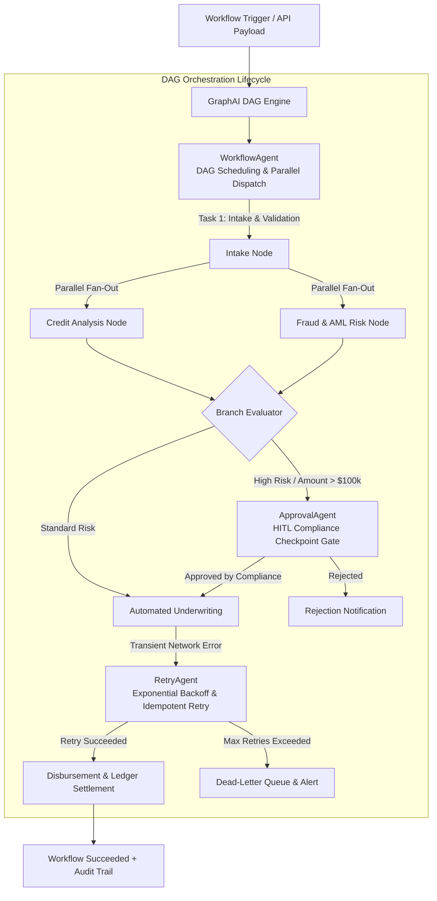

# GraphAI: Enterprise DAG Workflow Orchestration Specification

## 1. Executive Summary & Problem Formulation

Modern enterprise AI workflows require multi-step reasoning with strict dependencies, parallel execution fan-out, compliance checkpoint gates (Human-in-the-Loop), and resilient fault recovery. Linear or unstructured agent execution results in race conditions, unhandled exceptions, and regulatory violations.

**GraphAI** introduces a **graph-first DAG workflow orchestration architecture**:
1. **WorkflowAgent**: Dispatches nodes along topological orderings, executes parallel branch tasks, and evaluates conditional edge expressions.
2. **ApprovalAgent**: Halts execution at compliance policy gates, enforces dual-custody approval signatures, and resumes DAG runs deterministically.
3. **RetryAgent**: Handles transient errors via exponential backoff with jitter ($t = \min(\text{max\_backoff}, \text{base} \cdot 2^{\text{attempt}} + \text{jitter})$), guarantees idempotency, and routes unrecoverable exceptions to dead-letter queues.

---

## 2. DAG Workflow & Approval Architecture

---

## 3. Workflow Control & Fault Tolerance SLA

| Metric | Target SLA | GraphAI Mechanism |
| :--- | :--- | :--- |
| **Topological Resolution** | Zero race conditions | Strict DAG dependency solver (`DAGEngine`) |
| **HITL Authorization Latency** | Instantaneous suspend / resume | Immutable state checkpointing (`ApprovalAgent`) |
| **Transient Error Recovery** | $99.99\%$ self-healing | Exponential backoff with jitter (`RetryAgent`) |
| **Audit Traceability** | $100\%$ complete | Per-node attempt & duration ledger |

---

## 4. Multi-Agent Topology & Responsibilities

| Agent Name | Core Specialty | Key Performance Metric |
| :--- | :--- | :--- |
| **`WorkflowAgent`** | DAG node dispatch, topological ordering, parallel fan-out/fan-in. | Parallel dispatch efficiency ($100\%$). |
| **`ApprovalAgent`** | Compliance checkpoints, risk policy checks, HMAC signature validation. | Zero unauthorized state mutations. |
| **`RetryAgent`** | Exponential backoff calculation, transient error self-healing, dead-letter routing. | Self-healing recovery rate ($>99\%$). |
